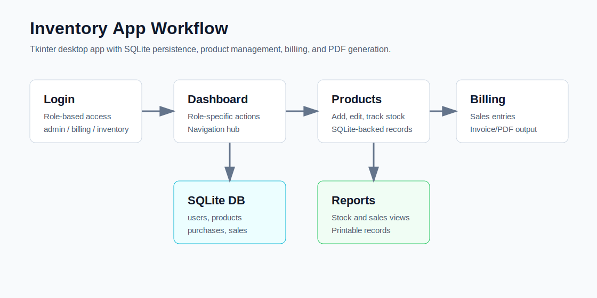

# Inventory App

Python Tkinter inventory management app with SQLite storage and PDF bill generation.

## Workflow Visual



## What It Does

- Login/dashboard based desktop workflow.
- Add and manage products.
- Track purchases and sales.
- Generate bills and reports.
- Store inventory data in SQLite.

## Tech Stack

- Python
- Tkinter
- SQLite
- Report/PDF generation utilities

## Structure

```text
main.py
gui/
modules/
utils/
```

## Setup

Use a Python build with Tkinter support. On macOS, Apple system Python usually includes Tkinter:

```bash
/usr/bin/python3 main.py
```

On Windows:

```bash
python -m venv .venv
.venv\Scripts\activate
pip install -r requirements.txt
python main.py
```

The app initializes `db/inventory.db` on first run.

Default demo users:

| Role | Username | Password |
| --- | --- | --- |
| Admin | `admin` | `admin123` |
| Billing | `billing` | `bill123` |
| Inventory | `stockman` | `stock123` |

## Validation

```bash
python -m py_compile main.py modules/*.py gui/*.py utils/*.py
python -c "from modules.db_init import init_db; init_db(); print('db ok')"
```

## What I Learned

- Building a multi-window desktop app with Tkinter.
- Separating GUI, data models, and utility code.
- Using SQLite for local persistence.
- Generating practical business documents from app data.
